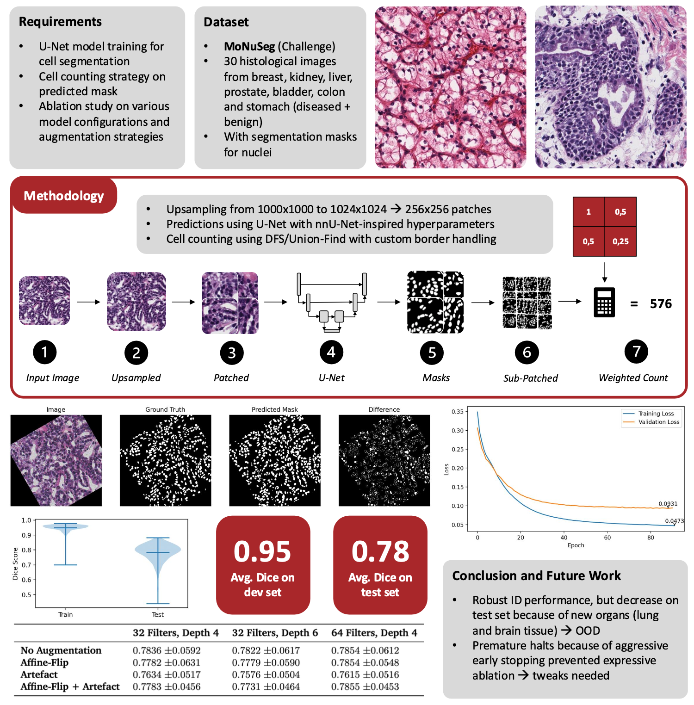

# MoNuSeg - Binary Nucleus Segmentation and Cell Counting via U-Nets

## Setup
1. Install [uv](https://docs.astral.sh/uv/)
2. Install the respective Python version via `uv python install <version>`

## Development
1. Install the development dependencies via `uv sync --dev`
2. Install the pre-commit hooks via `uv run pre-commit install`

## Usage
- Execute scripts located in [`src`](src) via `uv run src/<script>.py` (*note: this will set up the necessary Python environment and install all dependencies!*)
    1. On the first run, it is recommended to first execute the script to download the datasets via `uv run src/download.py`
    2. Afterward, execute `uv run src/preprocess.py` to extract the ground truths from the `.xml` annotations and apply patching to the images.
- To run the ablation study one can run `./run_experiments.sh <stage>`, whereas stage specifies the stage of the ablation study. The stages are:
    - `1`: U-Net sizes (32, 32, 64) with depths (4, 6, 4)
    - `2`: U-Net configurations as per stage `1`, but with affine and flip augmentation
    - `3`: U-Net configurations as per stage `1`, but with artefact augmentation
    - `4`: U-Net configurations as per stage `1`, but with all augmentations

## Dataset - [MoNuSeg](https://monuseg.grand-challenge.org/Data/)
- Training data can be found [here](https://drive.google.com/file/d/1ZgqFJomqQGNnsx7w7QBzQQMVA16lbVCA/view)
- Test data can be found [here](https://drive.google.com/file/d/1NKkSQ5T0ZNQ8aUhh0a8Dt2YKYCQXIViw/view)

The images and `.xml` ground truth annotations are expected to be located in the [`data/default`](data/default) directory, within the respective `train` or `test` directories.
